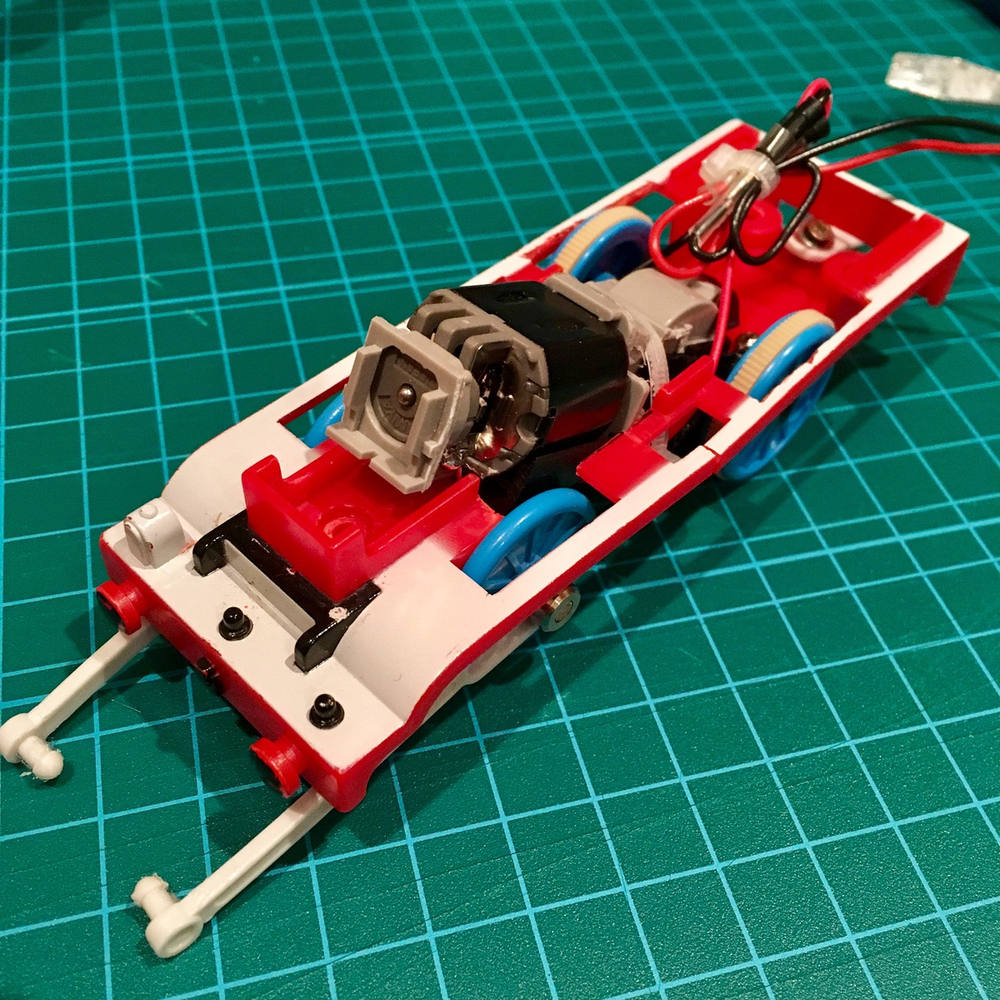
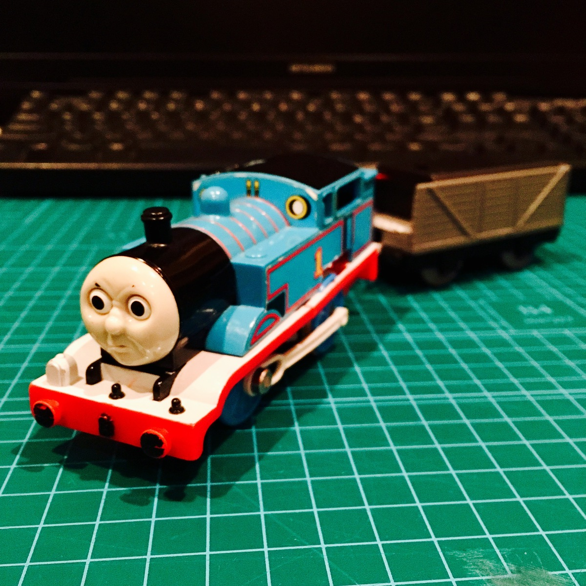

トーマスってタイヤについてる白い棒みたいなのがあるんですが、これをつけていなかったのでつけて走らせてみます。

つけてみました。

`youtube:https://youtube.com/embed/Xx3_uUwFRas`

ボディも載せて配線部分も穴あけて加工してボディ内にちゃんと収まるように細かい加工をしています。

`youtube:https://youtube.com/embed/p_sdEyYqJg4`

電源を入れてみるとちゃんと車輪回っていますね。

完成感ありますね！

`youtube:https://youtube.com/embed/0pIrezasOM4`

再び走行テストです。爆速感ありますね。ちょっと走行テストするにはミニ四駆のコース欲しくなりましたね。

つづく！

