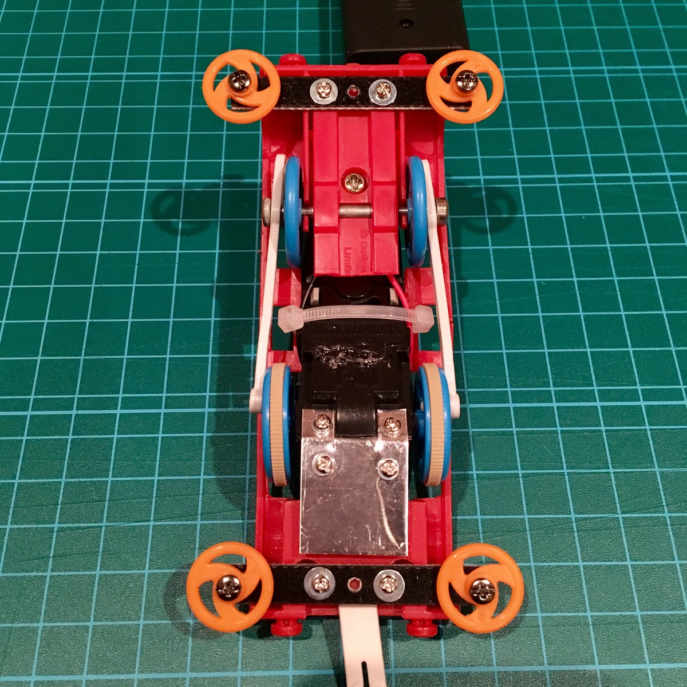
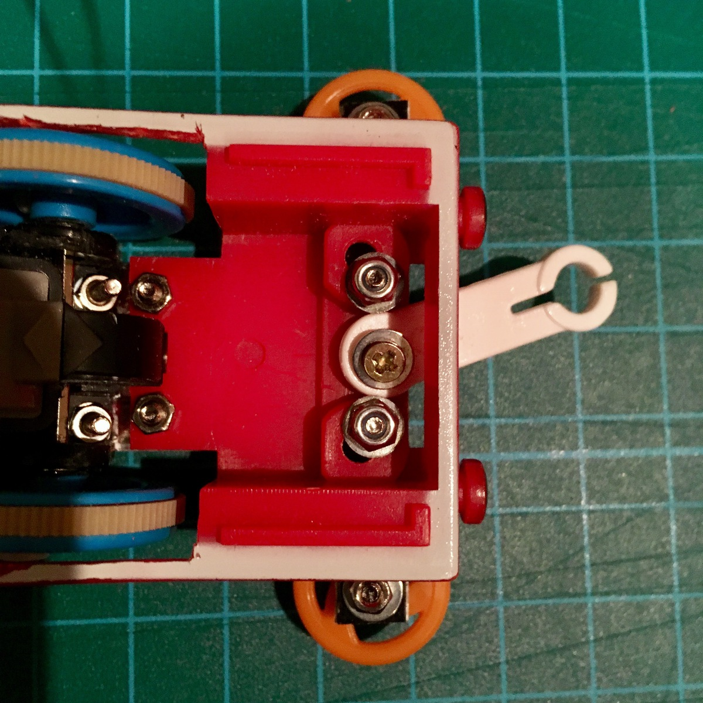
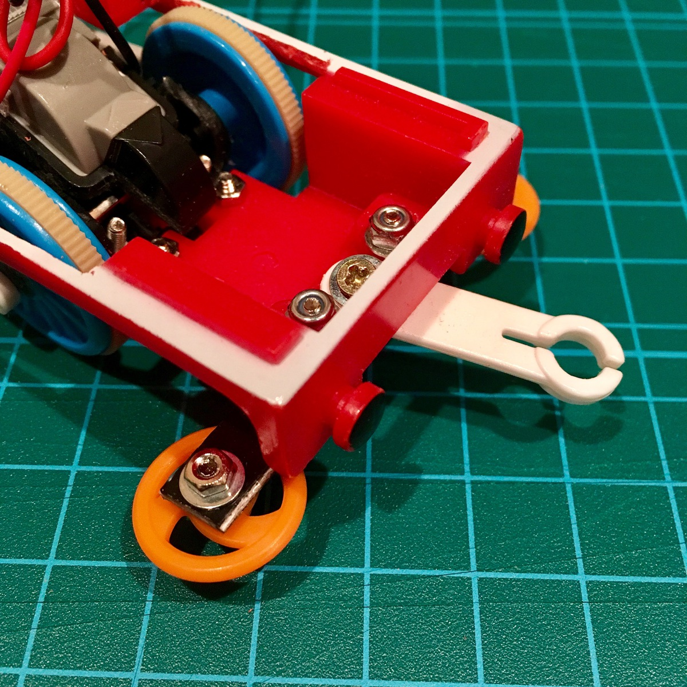
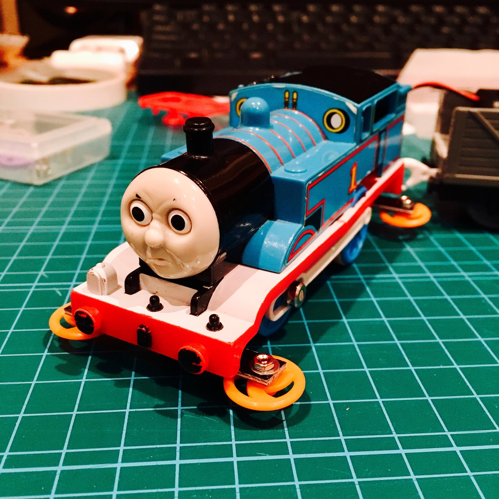

こんぬつは。さて、プラローラーつけたスーパートーマスの走行テストです。

こんな感じで前回ローラーをつけました。

プラレールの連結パーツもミニ四駆のビスで固定しています。ビスだらけになりましたね。

リアローラーも準備万端です。

トーマスカッコ良いですね！

`youtube:https://youtube.com/embed/k6b7VHvOBAw`

ということで走らせてみました。くるっと回りそうな走り方はするのですが、コースからはみ出しちゃいますね。これはいよいよミニ四駆のコースじゃないとダメなのでは…。

つづく！

